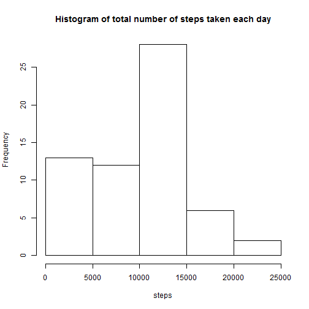
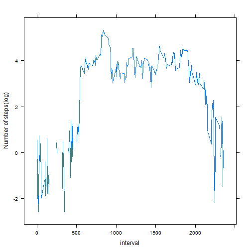
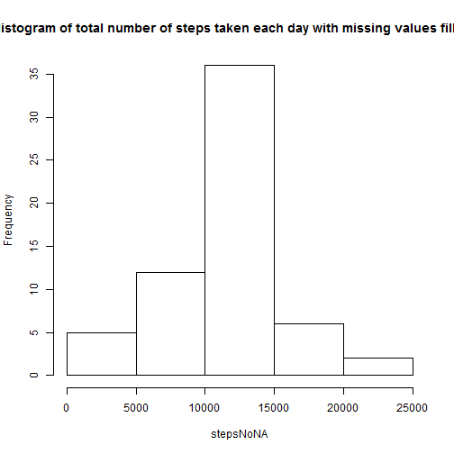
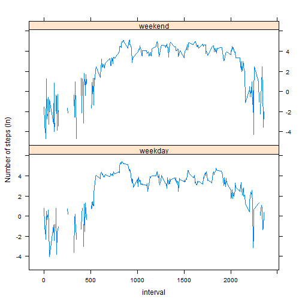

#Loading and preprocessing the data


```r
activity <- read.csv("activity.csv")
activity$date <- strptime(activity$date,format="%Y-%m-%d")
```

#What is mean total number of steps taken per day?


```r
steps <- tapply(activity$steps, strftime(activity$date), sum, na.rm=T)
hist(steps, main="Histogram of total number of steps taken each day")
```

 

```r
mean <- mean(steps)
median <- median(steps)
```

The mean and median of the total number of steps taken per day are 9354.2295082 and 
10395 respectively.

#What is the average daily activity pattern?


```r
library(lattice)
steps5min <- tapply(activity$steps, activity$interval, mean, na.rm=T)
interval <- as.numeric(names(steps5min))
xyplot(log(steps5min)~interval, type="l", ylab="Number of steps(log)")
```

 

```r
max <- interval[which.max(steps5min)]
```

The 5-minute interval, 835, on average across all the days in the dataset, contains the maximum number of steps.

#Imputing missing values


```r
miss <- length(which(is.na(activity)))
```

The total number of missing values in the dataset is 2304.

Create a new dataset and use the mean for that 5-minute interval to fill in all 
of the missing values in the dataset:


```r
missindex <- which(is.na(activity))
activityNoNA <- activity
for (i in 1:length(missindex)) {
    sub <- subset(activity, interval==interval[missindex[i]]) 
    m <- mean(sub$steps, na.rm=T) 
    activityNoNA$steps[missindex[i]] <- m
}

stepsNoNA <- tapply(activityNoNA$steps, strftime(activityNoNA$date), sum)
hist(stepsNoNA, main="Histogram of total number of steps taken each day with missing values filled in")
```

 

```r
meanNoNA <- mean(stepsNoNA)
medianNoNA <- median(stepsNoNA)
```

The mean and median of the total number of steps taken per day with missing 
values filled in are 1.0766189 &times; 10<sup>4</sup> and 1.0766189 &times; 10<sup>4</sup> respectively.

#Are there differences in activity patterns between weekdays and weekends?

Create a new factor variable in the dataset with two levels ¨C ¡°weekday¡± and ¡°weekend¡± indicating whether a given date is a weekday or weekend day.


```r
weekend <- which(weekdays(activityNoNA$date) %in% c("ÐÇÆÚÁù", "ÐÇÆÚÈÕ"))
activityNoNA$weekdays <- "weekday"
activityNoNA$weekdays[weekend] <- "weekend"
activityNoNA$weekdays <- as.factor(activityNoNA$weekdays)
```

Make a panel plot containing a time series plot of the 5-minute interval 
(x-axis) and the average number of steps taken, averaged across all weekday days or weekend days (y-axis).


```r
steps5minNoNA <- tapply(activityNoNA$steps, list(activityNoNA$interval, 
                                                 activityNoNA$weekdays), mean)
wd <- data.frame(interval=interval, steps=steps5minNoNA[ ,"weekday"], weekdays="weekday")
we <- data.frame(interval=interval, steps=steps5minNoNA[ ,"weekend"], weekdays="weekend")
wde <- rbind(wd,we)
xyplot(log(steps) ~ interval | weekdays, data = wde, layout = c(1, 2), type="l", ylab="Number of steps (ln)")
```

 
